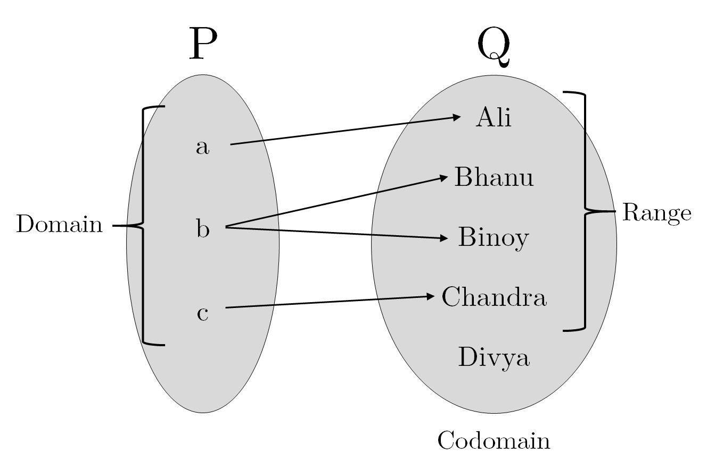

# **Relations and Functions**

## Cartesian Product of Two Sets
The set of ordered pairs of all possible combinations from both sets.

$$A = \{a, b\}$$
$$B = \{1, 2\}$$
$$A\times B=\{(a, 1), (a, 2), (b, 1), (b, 2)\}$$

> - **Ordered Pair** is a pair of elements in which the order of elements matter.
> $$(a_1, a_2)=(b_1, b_2) \text{ if } a_1 = b_1 \text{ and } a_2=b_2$$
> - $n(A\times B) = n(A) \times n(B)$

## Relation
A Relation from set $A$ to set $B$ is a relationship between the first and second element in $A\times B$. It is a **subset of $A\times B$**.

$$A = \{1, 2, 3\}$$
$$B = \{a, b, c\}$$
$$R_{AB} = \{(1, a), (2, b), (3, c)\}$$
\newline

$$P = \{a, b, c\}$$
$$Q = \{\text{Ali, Bhanu, Binoy, Chandra, Divya}\}$$
$$R_{PQ} = \{(x, y):x\text{ is the first letter of } y\}$$
$$R = \{(a, \text{Ali}), (b, \text{Bhanu}), (b, \text{Binoy}), (c, \text{Chandra})\}$$

### Some Important Terms

**Image**: The second element in an ordered pair is the image of the first element. (Chandra is the image of $C$)

**Domain**: The set of all first elements in the relation. ($D = \{a, b, c\}$)

**Range**: The set of all second elements in the relation. ($R$ = \{Ali, Bhanu, Binoy, Chandra\})

**Codomain**: The entire second set of the relation. ($C$ = \{Ali, Bhanu, Binoy, Chandra, Divya\})

## Functions
A function is a special kind of relation from set A to B, such that:

- Every element in set A has an image in set B
- Every element in set A has only one image

**Real Function**: A function where both domain and range are $R$ or its subsets.

## Some Important Functions

### Identity Function
$$f: R\to R; f(x)=x$$
$$\text{Domain} = R$$
$$\text{Range} = R$$

### Constant Function
$$f: R\to R; f(x)=c$$
$$\text{Domain} = R$$
$$\text{Range} = \{c\}$$

### Polynomial Function
$$f: R\to R; f(x)=a_0+a_1x+a_2x^2+\cdots+a_nx^n$$

$$f(x) = x^2$$
$$\text{Domain} = R$$
$$\text{Range} = R^+$$

$$f(x) = \frac1x$$
$$\text{Domain} = R - \{0\}$$
$$\text{Range} = R - \{0\}$$

$$f(x) = |x|$$
$$\text{Domain} = R$$
$$\text{Range} = [0, \infty)$$

$$ 
\text{Sigmum: }f(x) = 
     \begin{cases}
       \text{1,} &\quad\text{if } x>0\\
       \text{0,} &\quad\text{if } x=0\\
       \text{-1,} &\quad\text{if } x<0
     \end{cases}
$$
$$\text{Domain} = R$$
$$\text{Range} = \{-1, 0, 1\}$$

## Algebra of Real Functions

$$
\left.\begin{aligned}
f: X\to R\\
g: X\to R
\end{aligned}\right\rbrace X\subset R
$$

### Addition

$$(f+g)(x) = f(x)+g(x)$$

### Subtraction

$$(f-g)(x) = f(x)-g(x)$$

### Multiplication by a Scalar

$$(f\times \alpha)(x) = f(x)\times \alpha$$

### Multiplication

$$(f\times g)(x) = f(x)\times g(x)$$

### Quotient

$$\left(\frac fg\right)(x) = \frac {f(x)} {g(x)}$$
