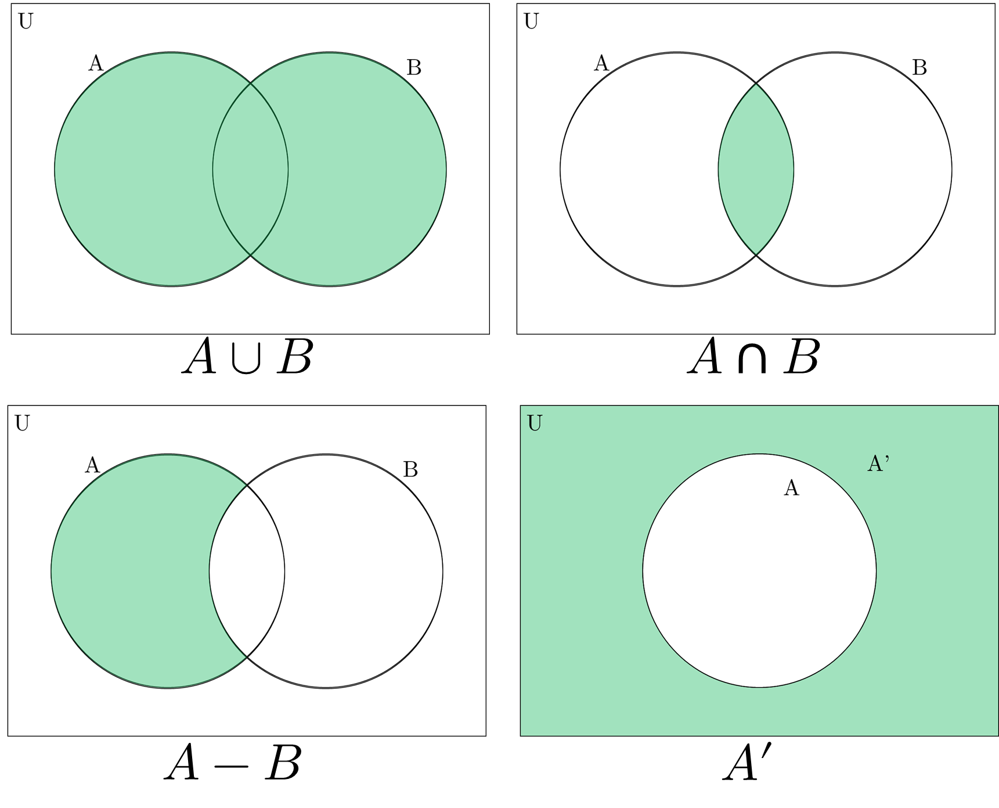

# **Sets**

A set is a **well defined collection of objects.** 

The following are some examples of valid sets.
$$N=\{1,2,3,4,5,\cdots\}$$
$$V=\{A, E, I, O, U\}$$
$$A=\text{\{all students in a class\}}$$

The following examples are not well defined, thus they cannot be called sets.
$$\text{F = \{toughest chapters in JEE Mains\}}$$

## Representation of a Set
A Set can be represented in two forms: 

1. **Roster form:** All the elements are listed in curly brackets (\{ \}). Multiple elements can be shown using $\cdots$.

$$A=\{3, 6, 9, 12, \cdots\}$$
$$B = \{\text{A, E, I, O, U}\}$$

2. **Set builder form:** Each element of the set is represented by a symbol ($x$). After the colon ($:$), the characteristic properties of the elements are mentioned.

$$A = \{x:x \text{ is divisible by 3}; x\in N\}$$
$$B = \{x:x \text{ is a vowel in the English alphabet}\}$$

> - The order in which elements are listed in a set do not matter.
> 
> $$\{a, b, c\} = \{c, a, b\}$$
>
> - All elements are counted only once in a set, i.e. repetition of elements in a set do not change the set.
> $$A = \{x:x \text{ is a letter in the word PLANE}\}$$
> $$B = \{x:x \text{ is a letter in the word PLAN}\}$$
> $$A=B=\{\text{A, L, N, P}\}$$

## Common Sets
\begin{align*}
  N &= \text{natural numbers}\\
  Z &= \text{integers}\\
  Q &= \text{rational numbers}\\
  R &= \text{real numbers}
\end{align*}

## Belongingness

$\in$ = belongs to \
$\not\in$ = does not belong to

$$A = \{x:x \text{ is a factor of 30}\}$$
$$5 \in A$$
$$7 \not\in A$$

## Null Set

A set which does not contain any element.

$$\phi = \{~ \}$$

> Two sets are said to be **equal** iff all the elements in both sets are same.
> $$A = \{x:0\le x\le 5; x\in Z\}$$
> $$B = \{ 0, 1, 2, 3, 4, 5 \}$$
> $$A = B$$

## Subsets

A set $X$ is the **subset of** set $A$ iff all elements of $X$ are in $A$

$$X = \{a, b\}$$
$$A = \{a, b, c, d, e\}$$
$$X\subset A$$

$\subset$ = proper subset of \
$\subseteq$ = subset of 

$$A\subset B \text{ if } x \in A \implies x \in B$$

> - $\phi$ is a subset of every set.
> - Every set is a subset of itself. $(A\subseteq A)$
> - $N \subset Z, Z\subset Q, Q\subset R$

## Intervals
An interval is a **subset of $R$** which denotes a range of real numbers.

**Notation:**  \
$[$ = closed end (included) \
$($ = open end (excluded)

$$\textbf{[a, b]} = \{x:a\le x\le b; x\in R\}$$
$$\textbf{[a, b)} = \{x:a\le x< b; x\in R\}$$
$$\textbf{(a, b]} = \{x:a< x\le b; x\in R\}$$
$$\textbf{(a, b)} = \{x:a<x<b; x\in R\}$$

- $(-\infty, \infty)$ is the set of all real numbers.
- **Length** of an interval $(a, b)$, $[a, b)$, $(a, b]$, $[a, b]$ is $(b-a)$

## Cardinal Number 
The number of elements in a set.

$$A=\{a, b, c\}$$
$$n(A)=3$$
$$n(\phi)=0$$

## Power Set

The set of all subsets.

$$A = \{a, b, c\}$$
$$P(A) = \{\phi, \{a\}, \{b\}, \{c\}, \{a, b\}, \{b, c\}, \{a, c\}, \{a, b, c\}\}$$

- The number of subsets = $2^n$ 
$$n(A)=m\implies n\left(P(A)\right)=2^m$$

## Universal Set
The set containing all the possible elements in a particular context.

$$U=R$$
$$A=\{x:x^2-6x+5=0; x\in R\}$$

- All sets are subset of $U$.

## Set Operations

### Union $(\cup)$
Combination of all elements in the sets

$$A = \{a,b, c\}$$
$$B = \{b, c, d, e\}$$
$$A\cup B=\{a,b,c,d,e\}$$

$$A\cup B=\{x:x\in A \text{ or } x\in B\}$$

### Intersection $(\cap)$
Elements which are common in both the sets

$$A = \{a,b, c\}$$
$$B = \{b, c, d, e\}$$
$$A\cap B=\{b,c\}$$

$$A\cap B=\{x:x\in A \text{ and } x\in B\}$$

### Difference $(-)$
Elements which are only present in the first set and not in the second set.

$$A = \{a,b, c\}$$
$$B = \{b, c, d, e\}$$
$$A- B=\{a\}$$

$$A - B = \{x:x\in A \text{ and } x\not\in B\}$$

### Complement $(')$
Elements which are not present in the set. (Inverse of the set)

$$U=\{a, b, c, d, e, f, g\}$$
$$A = \{a,b, c\}$$
$$A'=\{d, e, f, g\}$$

$$A'=U-A=\{x:x\not\in A; x\in U\}$$

{ width=600px }

## Algebra Laws of Sets

1. **Idempotent Law**
- $A\cup A=A$
- $A\cap A=A$
2. **Identity Law**
- $A\cap U=A$
- $A\cup\phi=A$
3. **Commutative Law**
- $A\cup B = B\cup A$
- $A\cap B = B\cap A$
4. **Associative Law**
- $(A\cup B)\cup C=A\cup (B\cup C)$
- $(A\cap B)\cap C=A\cap (B\cap C)$
5. **Distributive Law**
- $A\cup (B\cap C) = (A\cup B)\cap (A\cup C)$
- $A\cap (B\cup C) = (A\cap B)\cup (A\cap C)$
6. **De-Morgan's Law**
- $(A\cup B)'=A' \cap B'$
- $(A\cap B)'=A' \cup B'$
7. **Formulas in Practical Application**
- $n(A\cup B)=n(A)+n(B)-n(A\cap B)$
- $n(A\cup B\cup C)=n(A)+n(B)+n(C)-n(A\cap B)-n(B\cap C)-n(C\cap A)+n(A\cap B\cap C)$